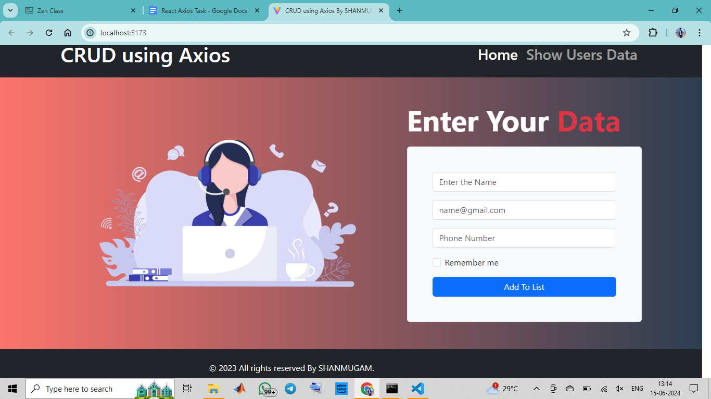

# CRUD Using Axios
A simple CRUD (Create, Read, Update, Delete) application built using React and Axios. This project demonstrates how to perform basic CRUD operations on user data.

# Features
1. Add new user data to the list
2. View a list of users with their details
3. Update user data
4. Delete user data from the list

